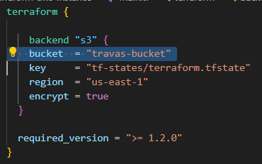

Relatório de Implantação da Infraestrutura na AWS com Terraform

**Caio Travain**

27\.11.2023

Computação em Nuvem

# INTRODUÇÃO
Este relatório descreve a arquitetura de infraestrutura implementada na AWS usando o Terraform. A infraestrutura inclui um VPC, Application Load Balancer (ALB), instâncias EC2, Auto Scaling, banco de dados RDS, e uma configuração distribuída de testes de carga usando Locust.
# Configuração do Ambiente
- Backend do Terraform:
  - Bucket S3: travas-bucket
  - Pasta do Estado: tf-states/terraform.tfstate
  - Região do Bucket S3: us-east-1
  - Criptografia: Habilitada
- Versão do Terraform: >= 1.2.0
- Região Padrão da AWS: us-east-1

O estado do ambiente é salvo no bucket “travas-bucket” onde fica armazenado na AWS todo estado do terraform que é utilizados para applicar as alterações e subir as aplicações.

Foi escolhida a região “us-east-1” ,ou seja, Leste dos EUA uma vez que deviamos levar em conta o gasto e os requisitos de latência da nossa aplicação. Como não precisamos de uma baixa latência para usarmos uma aplicação de teste, fomos com a mais barata. A região também oferece várias zonas de disponibilidades, nas quais poderíamos expandir e utilizar melhor o projeto para melhora de desempenho.
# Recursos da Infraestrutura
Foram criados 4 modulos para o provisionamento da infraestrutura após a criação da VPC para mandar os comandos de froma segura, sendo eles:

- Network - Responsável por criar todas as subnets, gateways, tabela de rotas e grupos de segurança. 

  Recursos Criados:

  - **AWS\_SUBNET**: Subnets associadas à VPC, incluindo subnets públicas e privadas.
  - **AWS\_INTERNET\_GATEWAY**: Um gateway de internet associado à VPC para permitir a conectividade com a internet.
  - **AWS\_ROUTE\_TABLE**: Tabelas de rotas associadas às subnets para controlar o tráfego de rede.
  - **AWS\_SECURITY\_GROUP**: Grupos de segurança associados à VPC para controlar o tráfego de entrada e saída.

- load\_balancer -Responsável por criar o Load Balancer e integralo com as subnets, grupos de segurança e um grupo de destino para rotear o tráfego para as instâncias EC2.

  Recursos Criados:

  - **AWS\_LB**: Um recurso representando o Application Load Balancer.
  - **AWS\_LB\_TARGET\_GROUP**: Um grupo de destino associado ao ALB para rotear o tráfego para as instâncias EC2.
  - **AWS\_LB\_LISTENER**: Um ouvinte associado ao load balancer para definir  roteamento de tráfego.

- scalling - Este módulo foi projetado para gerenciar e criara autoescala (Auto Scaling) das instâncias EC2, proporcionando flexibilidade com base nas demandas variáveis de carga de trabalho. 

  Recursos Criados:

  - **Launch Template**: Um recurso para garantir a criação e constancia das EC2 com a mesmas configurações
  - **Auto Scalling Group**: Um grupo definido de maquinas EC2 que podem ter um número maximo e minimo dependendo das políticas implementadas para a criação ou destruição de máquinas usando o Launch template
  - **Politicas e alarmes**: Criado alarmes e politicas de uso de cpu e requests no load balancer para criação de mais ou menos EC2 para suprir a demanda.

- rds - Este módulo foi projetado para gerenciar e criar instâncias de banco de dados Amazon RDS (Relational Database Service), proporcionando flexibilidade com base nas demandas variáveis de carga de trabalho.

  Recursos Criados:

  - **Instância RDS**: Um recurso que estabelece uma instância do Amazon RDS com configurações como tipo de banco de dados, versão, e parâmetros de backup e manutenção.
  - **Grupo de Subnets para o RDS**: Define um grupo de subnets da VPC onde a instância RDS será entregue.
  - **Grupo de Segurança para o RDS**: Cria um grupo de segurança para a instância RDS.

# Infraestrutura - Diagrama
# AutoScalling group

|<h2></h2>|<h2>Numero de maquinas</h2>|
| :- | :-: |
|Min|2|
|Max|8|
|Política de aumento por Cpu|20 %- 70%|
# Decisões - Caracteristicas
Foi utilizada 2 subnets privadas e 2 públicas para proteger as instâncias EC2 e o RDS interno e conectamos elas via um NAT e tabelas de rotas.  Também escolhemos o tamanho de t2.micro pois nossa aplicação não precisa de muitos recursos. Tivemos que utilizar dois tipos de políticas de autoscale, uma de cpu, caso a aplicação utilize muita CPU e outra por requests no load balancer, para garantir que temos instâncias suficientes para cuidar de todos os request e diminuir caso não tenha requests suficiente a cada 5 minutos.
# Aplicação
Aplicação é um docker que se instala com usando o  script “install.sh” e abre um servidor que utiliza um banco de dados postgresql que salva os ips e timestamp que qualquer um acessa e apresenta quando acessado pelo caminho de URL “/hits”

# Inicialização
Preparativos:

- Primeiro pegue seu SECRET TOKENS e configure usando o aws\_cli
- Crie um bucket manualmente e coloque o nome dele nesse trecho do código no lugar “bucket”

- Acesse o diretório "/learn-terraform-aws-instance" e de um *terraform init*
- De um *terraform Plan*
- De um *terraform apply*
- Para acessar sua aplicação vá para o painel da aws e pesquise por “load balancer” e clique no seu Load balancer e acesse o link em “Nome do DNS”
- Pode demorar um pouco para a aplicação subir, aguarde alguns minutos
- Agora era para estar funcionando a aplicação
- Se observar no terminal saiu um output com nome “dashboard\_url”,clique nele e abra na porta 8089 e utilize http
- ` `Agora utilize o locust para teste da aplicação
- Quando finalizar de terraform destroy 
# Custo

No mês de preparação e realização de testes e funcionamentos foram gastos 187,04 e com previsão de fechar o mês em 201,09 dolares, mas como foi um período de testes, para ambos os usuarios e  temos muito que economizar, como por exemplo a previsão de gastos para o mês de dezembro é de  165.28 dolares por mês.

Porém ao analizarmos podemos ver que a maioria dos gastos estão vinculados a EC2

Assim, poderíamos reduzir o tipo de EC2 que estamos utilizando e diminuir os gastos mensais com elas. Por exemplo as instâncias com Locust da minha parte foram feitas em c5n.xlarge e c5n.large, que geram muitos gastos e assim poderíamos reduzir mais os custos dessas instâncias. Também temos muitas instâncias para o Locust na qual só foram usadas para o teste de políticas de escalonamento, e que posteriormente podem ser finalizadas e abertas quando necessário. Também podemos reduzir ao vermos qual aplicação seriam utilizadas nessas instâncias e assim reduzir os gastos caso não fosse necessário tanto armazenamento e processamento. Nesses gastos também está envolvido alguns testes de politicas de autoscalling, 

Utilizando a calculadora da própria AWS temos que para criar um sistemas sem o locust gastariamos em torno de 116,44 dolares mensais utilizando  um autoscalling group de até 8 máquinas com duração de 8horas de pico para suprir uma demanda comum.

Agora adicionando o locust temos um gasto de 143,09 dolares mensais considerando que utilizariamos 10 horas dessas máquinas por semana. Algo que não foi implementado anteriormente e que permitiria testes de stress diários nas máquinas.

Essas estimativas foram feitas para uma aplicação básica que não requer muito processamento e tráfego de infromações, porém ela permite uma grande quantidade de usuarios usá-la devido as configurações de load balancer e RDS, otimizando seu desempenho. Eventualmente poderíamos reduzir esse custo para bem menos tendo uma base de quantos clientes mpedios entraram por dia em nossas instâncias e reduzindo a capacidade de suportá-los. Podendo reduzir em até 30% do valor, como visto abaixo.

Tudo isso apenas reduzindo o desempenho e disponibilidade das máquinas para um aplicação menor e reduzindo as 10 horas semanais para uma, ou seja, trocando para testes semanais.

####   
